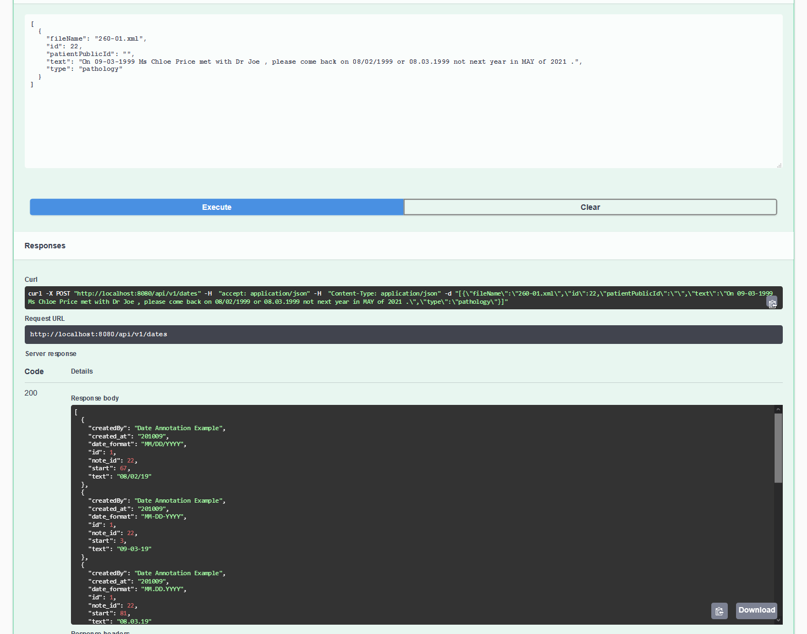
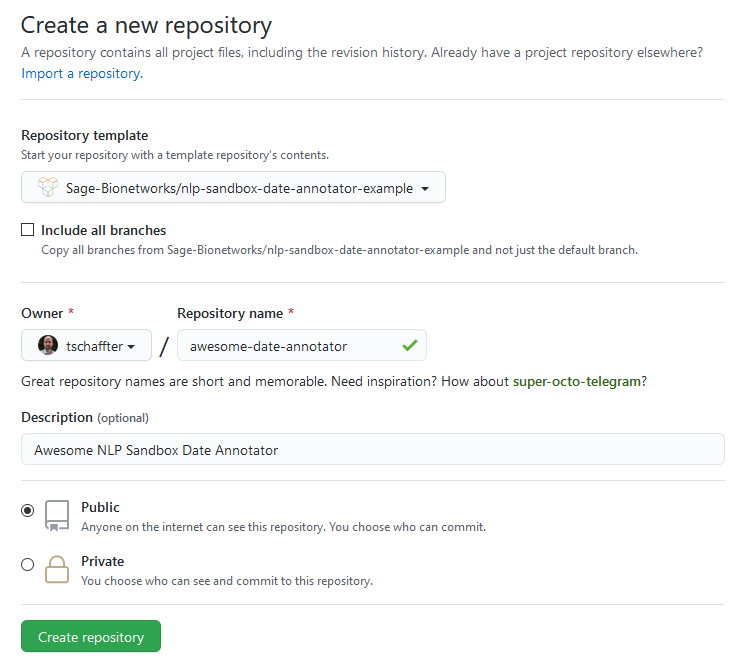

# NLP Sandbox Date Annotator Example

An example implementation of the [NLP Sandbox Date Annotator].

## Specification

- Annotates date strings in clinical notes using simple regular expressions
- Implements the [NLP Sandbox Date Annotator OpenAPI specification]

## Usage

### Running with Docker

The command below starts the Date Annotator locally.

    docker-compose up

### Running with Python

We recommend using a Conda environment to install and run the Date Annotator.

    conda create --name nlp-sandbox-date-annotator-example python=3.8.5
    conda activate nlp-sandbox-date-annotator-example

Install and start the Date Annotator.

    cd server/
    pip install .
    cd server && python -m openapi_server

## Annotating clinical notes

When running, the Date Annotator provides a web interface (http://localhost:8080/api/v1/ui/)
that you can use to explore the input, output and actions available.

## Development

This section describes how you can start developing your own Date Annotator that
you can then submit for evaluation to the NLP Sandbox.

### Requirements

- [Node JS](https://nodejs.org/)
- Java (required by [OpenAPITools/openapi-generator])

### Start developing your own server

One option is to [create a GitHub repository based on this template repository][create_gh_repo_from_template]
if you plan to write your code in Python. This repository comes with a GitHub
workflow that will help you implementing good practices and notify you when a
new version of the OpenAPI specification for this NLP Tool is available. The
GitHub workfow also includes a job to automatically submit your Date Annotator
to the NLP Sandbox for evaluation.

Alternatively, follow the steps listed below to generate an initial implementation
of the Date Annotator using one of the many languages and framework supported by
[OpenAPITools/openapi-generator].

Start by downloading the latest version of the [NLP Sandbox Date Annotator OpenAPI specification]
and save this file to the root folder of your project.

    curl -f -O https://sage-bionetworks.github.io/nlp-sandbox-schemas/date-annotator/latest/openapi.yaml

Create the file *package.json* with this content:

    {
        "name": "awesome-date-annotator",
        "version": "1.0.0",
        "license": "Apache-2.0",
        "devDependencies": {
            "@openapitools/openapi-generator-cli": "^1.0.18-4.3.1"
        },
        "scripts": {
            "test": "tox"
        }
    }

Install the dependencies listed in *package.json*

    npm install

Display help information about `openapi-generator`

    npx openapi-generator --help

Identify the server generator that you want to use from this list

    npx openapi-generator list

Generate the server codebase using the selected generator (here `python-flask`)

    npx openapi-generator generate -i openapi.yaml -g python-flask -o server

That's it! You can now start the Data Annotator server using the instructions
given in the section [Running using Python](#Running-with-Python).

### Update the codebase when a new OpenAPI spec is available

TBA

### Generate a Spring Boost server stub

Generate the initial server stub from the OpenAPI specification

    mkdir server
    npx @openapitools/openapi-generator-cli \
        generate -i openapi.yaml -g spring -o server

Build and start the server with Maven

    cd server
    mvn package
    java -jar target/openapi-spring-0.1.6.jar

The documentation UI is now available at http://localhost:8080.

<!-- Definitions -->

[NLP Sandbox Date Annotator]: https://github.com/Sage-Bionetworks/nlp-sandbox-schemas
[NLP Sandbox Date Annotator OpenAPI specification]: https://github.com/Sage-Bionetworks/nlp-sandbox-schemas
[OpenAPITools/openapi-generator]: https://github.com/OpenAPITools/openapi-generator
[create_gh_repo_from_template]: https://docs.github.com/en/free-pro-team@latest/github/creating-cloning-and-archiving-repositories/creating-a-repository-from-a-template#creating-a-repository-from-a-template